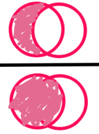

# `gff3-to-ddbj` の評価


## RefSeqデータを使っての比較


RefSeqが高品質データをGFF3+FASTAおよびGenBankフラットファイルを公開しているため、これを用いて `gff3-to-ddbj` の評価を行います。上の図のように `gff3-to-ddbj` でGFF3とFASTAから、そして`genbank-to-ddbj`でGenBankフラットファイルからそれぞれDDBJアノテーションを作成したうえで、このふたつの出力ファイルを比べます。ここで `genbank-to-ddbj` はフラットファイルの読み取りとDDBJアノテーション形式の書き込みに限定したつくりのため、評価に影響はないものと仮定しています。

比較は３つの基準で行います。どの場合も[多重集合](https://ja.wikipedia.org/wiki/多重集合) (multiset) を作ったうえで、集合の差と全体の要素数比から左側・右側それぞれについて**不一致**度合いを求める形です。ベン図で示すと以下のように、分子に差となる要素数、分母に参照データ側の全要素数が入ります。




#### 1. 位置情報（開始・終了点補正を無視）

アノテーションファイルの位置情報を含む各行から（エントリ名、feature名、補正なしのlocation）を要素とする多重集合を作ります。Locationでは開始点・終了点が不明であることを示す不等号は無視します。たとえば `join(12..78,134..202)` と `join(<12..78,134..202)`は同じものとみなします。


#### 2. 位置情報（補正等すべて含む）

１と同様に（エントリ名、feature名、location情報）を要素とする多重集合をつくります。しかし、２ではlocation情報には開始・終了点に付けられる不等号も含みます。つまり`join(12..78,134..202)` と `join(<12..78,134..202)`は違うものとして扱います。


### 3. Feature-Qualifier 情報

アノテーションファイルの位置情報を含む各行から（エントリ名、Feature名、Qualifierキー名）を要素とする多重集合を作ります。


## 評価の手順

1. RefSeq から評価用データをダウンロード (全配列 .fasta、アノテーション .gff、配列＋アノテーション .gbff の3種)

2. それぞれの tarファイルを展開して .gz ファイルを取り出しておく

3. GenBankフラットファイル から DDBJ に変換

   ```shell
   genbank-to-ddbj --gbk ./foo.gbff.gz > flatfile_foo.ann 2> flatfile_foo.err
   ```

4. FASTA + GFF から DDBJ に変換

   ```shell
   gff3-to-ddbj --fasta foo.fna.gz --gff3 foo.gff.gz --output foo.ann 2> foo.err
   ```

5. ２つの DDBJ 形式を比較

   ```shell
   compare-ddbj foo.ann flatfile_foo.ann
   ```

   `compare-ddbj` コマンドは、サマリーを表示すると同時に、それぞれの集合の差分をタブ区切りテキストとして書き出します。


## RefSeqのマウス参照ゲノムでの評価

### サマリー

* マウスゲノム([GRCm39]((https://www.ncbi.nlm.nih.gov/genome/annotation_euk/all/?utm_source=blog&utm_medium=referrer&utm_campaign=gdv&utm_term=intron&utm_content=20210202link1))) のFASTA, GFF3, GenBankフラットファイルを使っての評価
* RefSeq仕様との差がいくつか判明
    * RefSeq側でフラットファイルとGFF3に等価な情報を載せていないケース
        * 配列・アノテーション以外の情報に基づいたFeature位置の修正など
    * 10bp未満の短いイントロン除去に基づいた Featureの接続
    * `/pseudo`の扱い（DDBJは新規では使わない方針）
    * `assembly_gap` の表記の省略
        * フラットファイルで省略されるときの条件は不明


```shell
$ compare-ddbj GCF_000001635.27_GRCm39_genomic.ann flatfile_GCF_000001635.27_GRCm39_genomic.ann
WARNING:root:Location missing after a feature: ['', 'TOPOLOGY', '', 'circular', '']
------------------------------------------------------------
!! Other stats are affected if entry names are different !!
    Stat of entry names ...
    Left  mismatching: 0 / 61   (0.00 %)
    Right mismatching: 0 / 61   (0.00 %)
------------------------------------------------------------

Stat w/o location correction:
    Left  mismatching: 180 / 238362     (0.08 %)
    Right mismatching: 103 / 238285     (0.04 %)
Stat with location correction:
    Left  mismatching: 775 / 238362     (0.33 %)
    Right mismatching: 698 / 238285     (0.29 %)
Stat of feature-qualifier pairs:
    Left  mismatching: 103360 / 1018736         (10.15 %)
    Right mismatching: 101569 / 1016945         (9.99 %)
```


### Feature-Qualifier の差異について

まずは差異のおおきい第3項目のfeature-qualifierペアに注目します。左側（＝ `gff3-to-ddbj`出力側）の103360個の差分は以下のように要約されます。

```shell
$ cat quals_left-only.txt | awk '{print $2, $3}' | sort | uniq -c | sort -rhb
  93152 CDS transl_table
   8126 exon pseudogene
    666 CDS product
    530 misc_RNA pseudogene
    220 assembly_gap linkage_evidence
    176 CDS pseudogene
    153 V_segment pseudogene
     92 assembly_gap gap_type
     92 assembly_gap estimated_length
     61 source note
     21 tRNA note
     13 regulatory_TATA_box note
     12 J_segment pseudogene
     10 D_segment pseudogene
      8 protein_bind note
      7 regulatory_enhancer note
      7 CDS note
      4 ncRNA_lncRNA pseudogene
      3 regulatory_CAAT_signal note
      2 regulatory_promoter note
      1 rRNA note
      1 regulatory_locus_control_region note
      1 regulatory_imprinting_control_region note
      1 regulatory_enhancer_blocking_element note
      1 C_region pseudogene
```

同様に右側（`genbank-to-ddbj`側）の291968個の差分は以下のようになります。

```shell
$ cat quals_right-only.txt | awk '{print $2, $3}' | sort | uniq -c | sort -rhb
  92499 CDS translation
   8126 exon pseudo
    530 misc_RNA pseudo
    176 CDS pseudo
    153 V_segment pseudo
     15 assembly_gap gap_type
     15 assembly_gap estimated_length
     13 CDS function
     13 CDS EC_number
     12 J_segment pseudo
     10 D_segment pseudo
      4 ncRNA_lncRNA pseudo
      2 misc_feature gene_synonym
      1 C_region pseudo
```

ここから以下のようなことが判ります。

* 左側（＝ `gff3-to-ddbj` 出力側）ではすべてのCDSに `/transl_table` qualifier を付けているのに対し、GenBank側はあまり付けてない。方針の違いによるもの。
* GFF3にて `ID=` となっているものはそのまま `/note=ID:...` に記録されるため、左側のみに `note` が多い。
* 右側（＝ `genbank-to-ddbj` 出力側）ではCDSに基本 `/translation` qualifier がついている。これはGenBankが最終形のフラットファイルであるのに対し、DDBJアノテーションは最終処理前で `/translation` が付けられる前の状態であるので問題なし。
* DDBJの `/pseudo` qualifier を使わない方針に従って `/pseudogene` で代替している。そのため左右に `/pseudogene` と `pseudo` が来るのは折込み済み。


## 位置補正無視時の差分について
位置補正を無視したときの差分の内容です。

```
$ cat loc_wo_correction_left-only.txt | awk '{print $2}' | sort | uniq -c | sort -rhb
    162 assembly_gap
      9 mRNA
      9 CDS

$ cat loc_wo_correction_right-only.txt | awk '{print $2}' | sort | uniq -c | sort -r
     85 assembly_gap
      9 mRNA
      9 CDS
```

ここで `mRNA` および `CDS` の位置情報の違いはNCBIには 10bp未満のイントロンを載せない方針のためです。Feature間の隙間が小さいときには `join()`記法ではなくひとつながりのFeatureに置き換えられるようです。同様の操作がDDBJ登録で求められるのかは調査中ですが、`compare-ddbj` に `--patch-features` を付けるとFeature間の小さな隙間を無視して比べる仕様になっています。
```shell
# gff3-to-ddbjからの出力 (NC_000069.7)
$ cat GCF_000001635.27_GRCm39_genomic.ann | rg '93184880' | awk '{print $1,$2}'
    CDS join(93184880..93185017,93186688..93189789,93189836..93192439,93192441..93193928,93194694..93200516)

# フラットファイルからの出力 (NC_000069.7)
$ cat flatfile_GCF_000001635.27_GRCm39_genomic.ann | rg --after-context=2 '93184880' | bat -p --tabs 4
    CDS join(93184880..93185017,93186688..93189789,93189836..93193928,93194694..93200516)   gene    Flg
            exception   unclassified translation discrepancy
            note    The sequence of the model RefSeq protein was modified relative to this genomic sequence to represent the inferred CDS: deleted 1 base in 1 codon; substituted 2 bases at 2 genomic stop codons; Derived by automated computational analysis using gene prediction method: Gnomon.
```


`assembly_gap` については、たとえば `NC_000086.8` についてGenBankフラットファイルを見てみます。
```
     assembly_gap    1..100000
                     /estimated_length=100000
                     /gap_type="telomere"
     assembly_gap    100001..110000
                     /estimated_length=10000
                     /gap_type="short arm"
     assembly_gap    110001..3000000
                     /estimated_length=2890000
                     /gap_type="centromere"
     assembly_gap    3000001..3050000
                     /estimated_length=50000
                     /gap_type="between scaffolds"
```
ここから、ひとつながりの `assembly_gap` が各部の意味によって分割されていることが分かります。いっぽう `gff3-to-ddbj` では単に`N`を数えて `assembly_gap`を求めます。そのため差異が発生しています。

またフラットファイルでは配列に`N`が連なっていても `assembly_gap`表記しないケースも散見されます。このフラットファイルの仕様については調査中です。


## 位置情報の差異について

位置情報の差異の元をたどるには、位置情報に基づいて精査する必要があります。たとえば以下のようなコマンドで気になる位置の検索をかけます。ここで [rg](https://github.com/BurntSushi/ripgrep) は高速版grep、[bat](https://github.com/sharkdp/bat) は cat/less的なものです。インストールできない場合には grep, lessに置き換えてください。
```
$ cat GCF_000001635.27_GRCm39_genomic.gbff | rg --after-context=50 --before-context=50 54715096 | bat -p
```

以下、確認済みの要因です。

* RefSeq は 各種RNA と CDS Feature が locationにおいて完全一致するばあい GenBank出力にて RNAを削除することがあります。
    * 発生条件を調査中。

* `gff3-to-ddbj` は CDS にのみ、start codon, stop codon に応じた `<` や `>` による開始・終了位置補正を行っています。いっぽう RefSeq のGenBankフラットファイルでは各種RNAなど、CDSの上位階層FeatureにもCDSに対応した位置の補正が行われています。
    * 同様の操作がDDBJ登録で求められるのか調査中。

* RefSeq アノテーションプログラム (gnomon) は入力データに無い塩基対を補足することがあり、そのばあい以下のような `/note` が付けられます。これにより開始・終了点補正がさまざまなところに入れられて、locationが異なるという結果になります。
    * これは変換ツールとしての `gff3-to-ddbj`の守備範囲外とします

  ```
         /note="The sequence of the model RefSeq protein was
          modified relative to this genomic sequence to represent
          the inferred CDS: added 170 bases not found in genome
          assembly; Derived by automated computational analysis
          using gene prediction method: Gnomon."
  ```

## DDBJ公開の配列データ・フラットファイルからの評価

### サマリー

* FASTAのみの入力
    * そのため `source` と `assembly_gap` のみの Feature となる
* キクタニギク (BPTQ01000001) において `assembly_gap` の位置はフラットファイルと全一致
* `source` に関して[メタデータを適切に設定](https://github.com/yamaton/gff3toddbj/blob/main/README-ja.md#%E3%83%A1%E3%82%BF%E3%83%87%E3%83%BC%E3%82%BF%E3%83%95%E3%82%A1%E3%82%A4%E3%83%AB)しておく必要がある


### 手順
DDBJのフラットファイルは、ほぼGenBankのフラットファイルと同じであるのでRefSeq時と同じ手順で動作させられます。ここではキクタニギクの配列データの一部を使ってみます。

```shell
# BPTQ のフラットファイルおよびFASTAをダウンロード
wget --output-document BPTQ01000001.txt.gz 'https://getentry.ddbj.nig.ac.jp/getentry/na//BPTQ01000001/?format=flatfile&filetype=gz&trace=true&show_suppressed=false&limit=0'
wget --output-document BPTQ01000001.fa.gz 'https://getentry.ddbj.nig.ac.jp/getentry/na//BPTQ01000001/?format=fasta&filetype=gz&trace=true&show_suppressed=false&limit=0'

# フラットファイルをDDBJアノテーションファイルに変換
genbank-to-ddbj --gbk BPTQ01000001.txt.gz > flatfile_BPTQ01000001.ann

# FASTAのみからDDBJアノテーションファイルを作成。エラーログを<basename>.errとしてセーブ
time gff3-to-ddbj --fasta BPTQ01000001.fa.gz --output BPTQ01000001.ann 2> BPTQ01000001.err

# 2つのファイルを比較
compare-ddbj BPTQ01000001.ann flatfile_BPTQ01000001.ann
```

### 結果

以下のような出力を得ます。

```
------------------------------------------------------------
!! Other stats are affected if entry names are different !!
    Stat of entry names ...
    Left  mismatching: 0 / 1    (0.00 %)
    Right mismatching: 0 / 1    (0.00 %)
------------------------------------------------------------

Stat w/o location correction:
    Left  mismatching: 0 / 4917         (0.00 %)
    Right mismatching: 0 / 4917         (0.00 %)
Stat with location correction:
    Left  mismatching: 0 / 4917         (0.00 %)
    Right mismatching: 0 / 4917         (0.00 %)
Stat of feature-qualifier pairs:
    Left  mismatching: 0 / 14750        (0.00 %)
    Right mismatching: 4 / 14754        (0.03 %)
```

不一致は最後のfeature-qualifierペア部のみです。差分は `quals_right-only.txt` に出力されています。

```shell
$ cat quals_right-only.txt
BPTQ01000001.1  source  collection_date
BPTQ01000001.1  source  country
BPTQ01000001.1  source  strain
BPTQ01000001.1  source  submitter_seqid
```

この内容から、デフォルト設定のメタデータの`source`項目にに `collection_date` などの項目が無かったためと分かりました。
デフォルト設定のメタデータはサンプルとしてのみの役割で、実用では[TOMLファイルを設定](https://github.com/yamaton/gff3toddbj/blob/main/README-ja.md#%E3%83%A1%E3%82%BF%E3%83%87%E3%83%BC%E3%82%BF%E3%83%95%E3%82%A1%E3%82%A4%E3%83%AB)したうえで `--metadata`オプションからロードして頂くことを想定しています。

